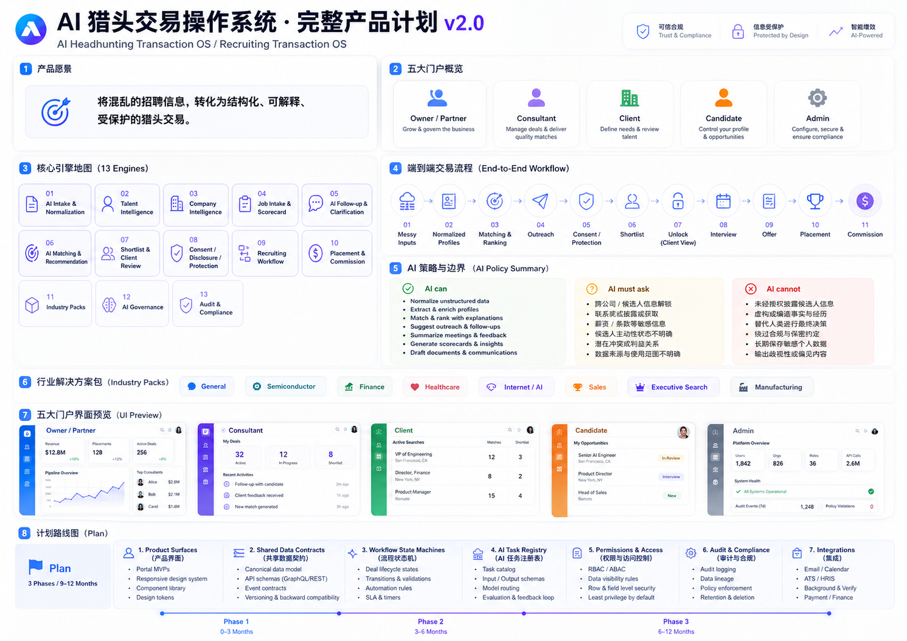
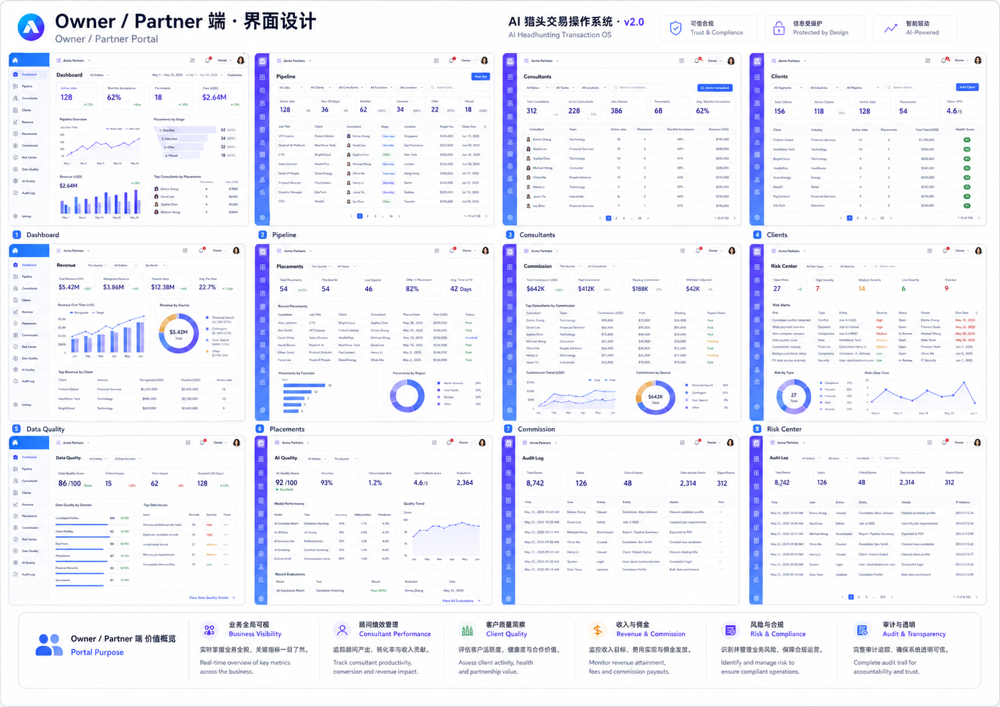
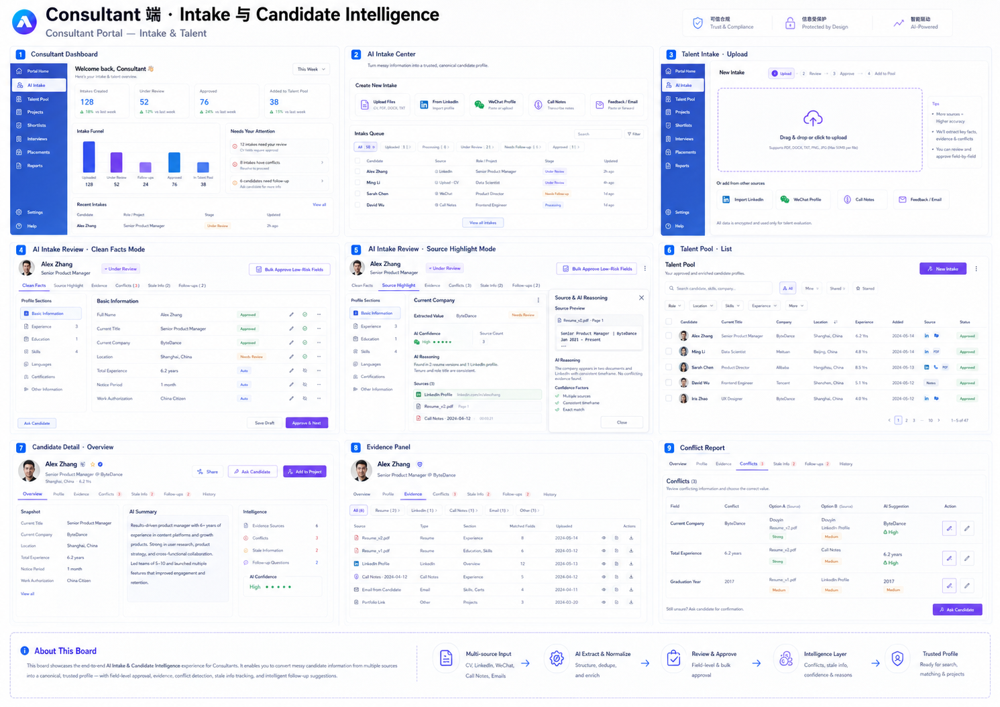
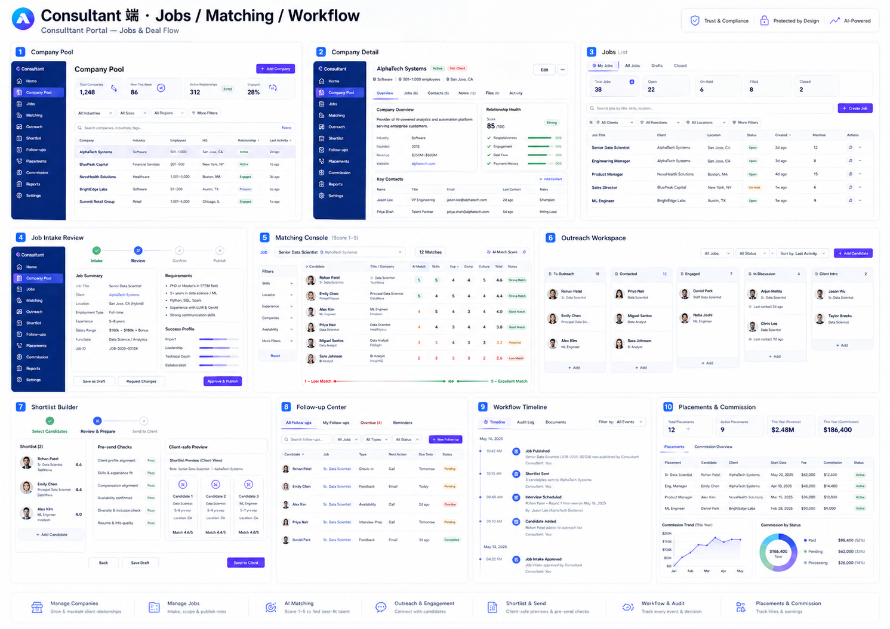
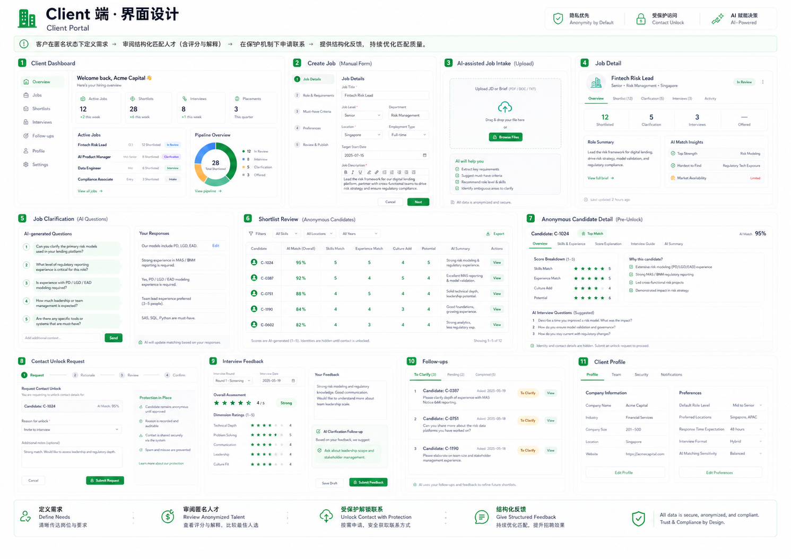
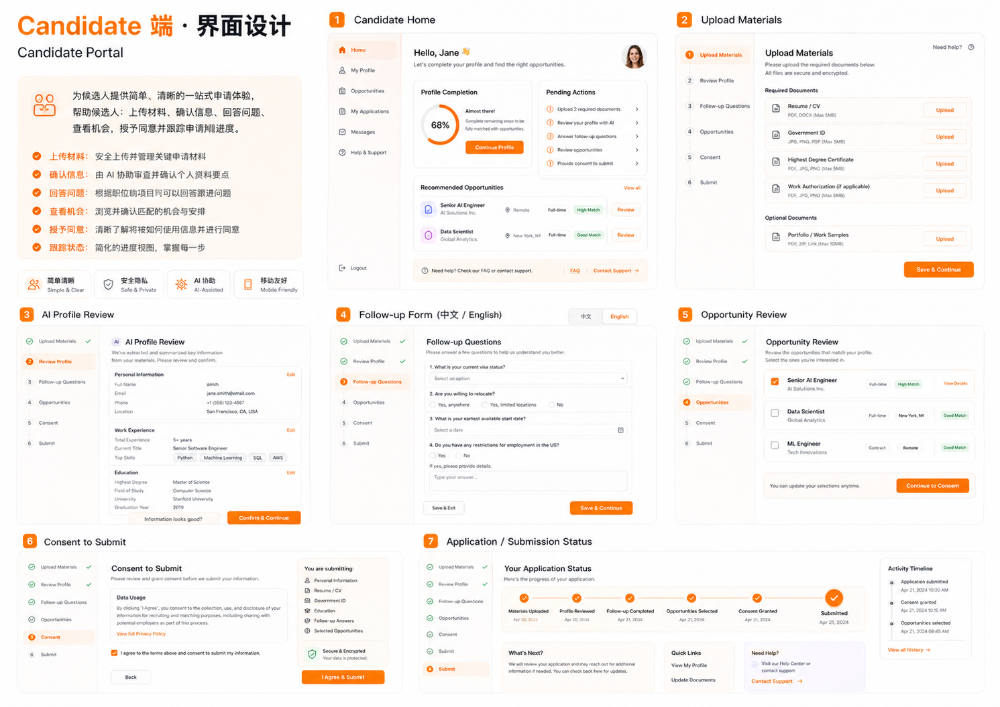
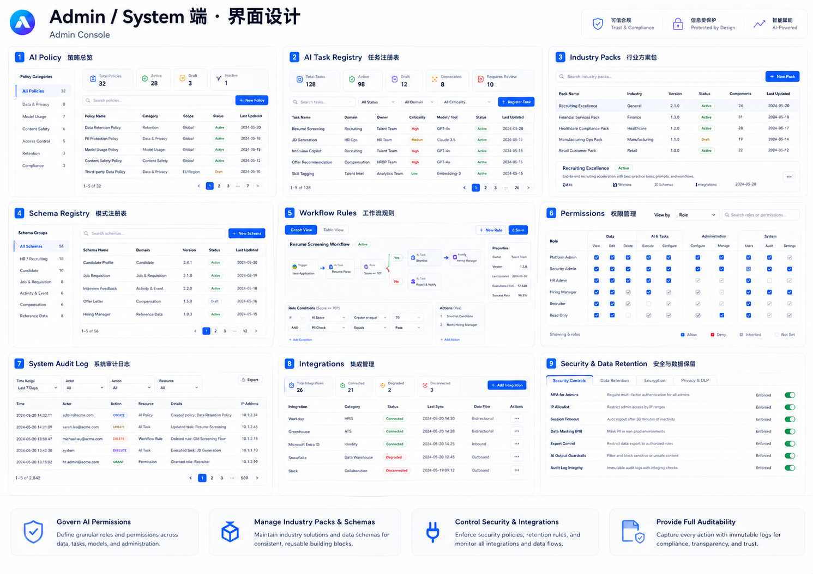

<!-- DOCX footer (footer1.xml): 完整产品规格书 v2.1｜全量保留 v2.0 + 治理架构重构 -->

<!-- DOCX header (header1.xml): AI Headhunting Transaction OS · v2.1 Full Spec -->

**AI 猎头交易操作系统**

**完整产品规格书 v2.1｜全量保留 v2.0 + 治理架构重构版**

AI Headhunting Transaction OS / Recruiting Transaction OS

**文档类型：完整产品规格书 / UI 设计规划 / AI 权限策略 / 数据模型 / 技术架构 / 治理与验收标准**

适用对象：产品、设计、工程、AI Workflow、合规、猎头公司管理层

 

# 版本说明

| **项目** | **说明** |
| --- | --- |
| **产品名称** | **AI 猎头交易操作系统 / AI Headhunting Transaction OS** |
| **版本** | **v2.1｜全量保留 v2.0 内容 + Governance Architecture Patch** |
| **核心升级** | **在 v2.0 “信息整理 + AI 匹配 + 交易 workflow + 授权披露保护 + 行业包”的完整产品级操作系统基础上，新增反假确认、Claim Ledger、冷启动诚实机制、Living Ontology、匿名反推风险控制、AI 简历军备竞赛防御，以及 Java Core + Go Tools 的生产级技术架构。** |
| **UI 设计** | **完整保留 v2.0 内置 7 张高保真 UI 设计图：总览、Owner、Consultant 设计板 A、Consultant 设计板 B、Client、Candidate、Admin。v2.1 不删除原 UI，而是在同一五端门户内增加治理状态、风险提示、审计与质量指标。** |
| **设计原则** | **AI-first，但不是 AI-final；Human-confirmed 进一步升级为 Risk-tiered confirmation。AI 能整理、生成、追问、提醒、草拟，但影响事实、授权、披露、商业条款、佣金归属和客户可见陈述的动作必须经过服务层门禁。** |
| **技术路线** | **Java / Spring Boot / Spring AI Alibaba 作为核心业务与 AI 编排主干；PostgreSQL 作为事实源；RAGFlow/文档智能服务作为证据解析层；MCP 作为受控工具协议；Go 仅作为高性能辅助服务。** |
| **v2.1 修订原则** | **不压缩、不替换 v2.0 的有效内容；保留原规格书的五端 UI、页面规格、AI Task Registry、数据对象、Workflow 状态机、Industry Pack、Delivery Plan 和验收结构，并在对应章节中嵌入治理升级。** |

# 目录

0. 执行摘要与 v2.1 修订边界

1. 产品总述与定位

2. 产品原则

3. 完整系统架构

4. 五端用户与权限边界

5. UI 设计图总览

6. Owner / Partner 端规格

7. Consultant 端规格

8. Client 端规格

9. Candidate 端规格

10. Admin / System 端规格

11. AI Operating Policy

12. AI Task Registry

13. 数据对象与字段模型

14. Workflow 状态机

15. Match Score 体系

16. Industry Pack 体系

17. Consent / Disclosure / Protection 体系

18. Full Product Delivery Plan

19. Engineering 指令

20. 验收标准

| **v2.1 阅读说明：本版不是压缩版** 本文件以 v2.0 完整规格书为底稿。原有 7 张 UI 设计图、五端页面规格、AI Task Registry、数据对象、状态机、Industry Pack、Delivery Plan、Engineering 指令和验收标准全部保留。v2.1 的新增内容被插入到对应章节中，而不是简单附在末尾。 |
| --- |

# **0. 执行摘要与 v2.1 修订边界**

**v2.1 的目标不是重写 v2.0，也不是为了做一个更厚的文档。它的目标是把 v2.0 已经定义清楚的产品表面、五端门户、workflow、AI task、industry pack 和授权披露保护，升级为可以承受真实业务压力、真实数据污染、真实客户反推和真实 AI 简历军备竞赛的完整产品规格。**

| **v2.0 已有资产** | **v2.1 保留方式** | **v2.1 新增治理能力** |
| --- | --- | --- |
| **五端门户与 7 张 UI 设计图** | **完整保留，仍作为信息架构与交互路径基准。** | **在相同页面内增加质量门禁、风险标签、审计入口和 AI task 状态。** |
| **AI Operating Policy** | **保留 AI can / must ask / cannot 三段式边界。** | **把 must ask 升级为 risk-tiered gates，避免确认疲劳导致虚假 confirmed。** |
| **Evidence before score** | **保留 evidence、source、trust 的基本原则。** | **升级为 Claim Ledger，区分 explicit / implied / weak signal / system inference。** |
| **Industry Packs** | **保留 8 个行业包和可切换机制。** | **增加 maturity、ontology version、drift detection 和冷启动评分上限。** |
| **Anonymity by default** | **保留 unlock 前匿名机制。** | **增加 re-identification risk score，防止高端人才被特征反推。** |
| **Match Score 1-5** | **保留总分、维度分和解释。** | **增加 evidence coverage、score confidence、authenticity risk 和 provenance weighting。** |
| **工程指令** | **保留 contracts-first、workflow event、AI registry 等方向。** | **固定 Java Core + Go Tools 架构，禁止低代码平台成为事实源。** |

**v2.1 的核心判断：AI 越强，越不能让 AI 自己定义事实。完整产品的护城河不是模型名称，而是事实治理、授权保护、证据链、行业本体、审计和反馈闭环。**

 

# 1. 产品总述与定位

AI 猎头交易操作系统是一个面向猎头公司、企业客户、候选人和猎头管理者的全行业 AI 招聘交易平台。它通过 AI 整理三端混乱信息，生成可信候选人、企业和岗位画像，自动追问缺失信息，进行证据化匹配，生成可解释推荐，并通过 workflow、consent、disclosure、prior contact、offer、placement、commission 等机制完成招聘交易全生命周期管理。

它不是招聘网站，不是普通 ATS，不是通用 CRM，也不是简历评分工具。它是一个 Data-to-Deal System：把混乱招聘信息转化为可推进、可解释、可保护、可审计的猎头交易。

## 1.1 一句话定义

将混乱的招聘信息，转化为结构化、可解释、受保护、可推进的猎头交易。

## 1.2 核心业务对象

- 人才：候选人不是一份简历，而是一个随时间演化的动态交易资产。

- 企业：企业不是客户名片，而是长期合作关系、偏好、反馈、付款与风险记录。

- 岗位：岗位不是 JD，而是业务上下文、scorecard、商业条款、workflow 状态。

- 推荐：推荐不是分数，而是证据、解释、风险、缺口和授权状态。

- 交易：交易不是消息来回，而是可追踪的状态机和审计账本。

# 2. 产品原则

| **编号** | **原则** | **说明** |
| --- | --- | --- |
| **P1** | **AI-first, human-confirmed** | **AI 负责整理和草拟；影响事实、授权、披露、商业条款、佣金归属的动作必须人工确认。** |
| **P2** | **Raw input is not fact** | **上传材料、候选人自述、顾问笔记、AI 推断都不能直接等于事实，必须保留 source、trust、status。** |
| **P3** | **Evidence before score** | **所有匹配分数必须有解释，所有解释必须有证据，所有证据必须有来源与可信度。** |
| **P4** | **Anonymity by default** | **企业端在 unlock 前只看到匿名候选人信息，不能看到真实姓名、联系方式和敏感内部备注。** |
| **P5** | **Workflow over chat** | **AI 不是泛聊天入口，而是任务引擎、数据整理器、workflow 推进器和审计参与者。** |
| **P6** | **Industry configurable** | **全行业通用不是死字段，而是平台内核 + industry pack。** |

## **2.1 v2.1 新增治理原则**

| **编号** | **原则** | **说明** |
| --- | --- | --- |
| **P7** | **Risk-tiered confirmation** | **人工确认必须按风险分层。低风险字段可以批量处理；客户可见、法律/交易相关字段禁止批量确认。** |
| **P8** | **Claim Ledger before canonical fact** | **AI 从混乱资料中产生的是 claim，不是 fact。只有通过来源、强度、状态和门禁后，才允许写入 canonical profile。** |
| **P9** | **Bulk approve is not verified** | **顾问批量通过最多代表 human_acknowledged，不能自动成为 candidate_confirmed 或 external_verified。** |
| **P10** | **Provenance-weighted matching** | **匹配分数必须按证据来源加权。AI 优化简历文本不能和客户面试反馈、可验证项目证据同权。** |
| **P11** | **Anonymity means re-identification control** | **匿名不是隐藏姓名，而是控制客户通过履历、项目、时间线、罕见成就反推出候选人身份的风险。** |
| **P12** | **Living ontology** | **行业包不是静态配置表，而是有版本、有效期、漂移信号、废弃关系和反馈回流的活知识系统。** |
| **P13** | **Backend owns truth** | **AI 编排平台、低代码 workflow、MCP 工具和模型都不能成为事实源；事实源必须在核心后端和数据库。** |

# 3. 完整系统架构

完整产品由五类用户端、十三个核心引擎、统一数据层、统一 AI task registry、统一 workflow engine 和统一 audit layer 组成。

## 3.1 五类用户端

| **用户端** | **使用者** | **核心价值** |
| --- | --- | --- |
| **Owner / Partner** | **猎头老板、合伙人、团队负责人** | **业务全局可视、顾问绩效、客户质量、收入佣金、风险合规。** |
| **Consultant** | **一线猎头顾问** | **AI intake、人才库、企业库、岗位、匹配、outreach、shortlist、placement。** |
| **Client** | **企业 HR、TA、用人经理** | **提交岗位、回答澄清、审阅匿名 shortlist、请求 unlock、提交反馈。** |
| **Candidate** | **候选人** | **上传材料、确认资料、回答 follow-up、查看机会、授权推荐、查看状态。** |
| **Admin / System** | **管理员、AI 治理、运营、合规** | **AI 权限、任务注册、行业包、schema、workflow、权限、审计、安全。** |

## 3.2 十三个核心引擎

| **#** | **核心引擎** | **职责** |
| --- | --- | --- |
| **1** | **AI Intake & Normalization** | **处理混乱资料，分类、去重、版本判断、冲突检测、生成 canonical draft。** |
| **2** | **Talent Intelligence** | **候选人画像、证据、冲突、历史、授权、匹配与提交记录。** |
| **3** | **Company Intelligence** | **企业偏好、联系人、历史职位、反馈风格、付款可靠性与绕过风险。** |
| **4** | **Job Intake & Scorecard** | **岗位 intake、业务上下文、scorecard、激活检查、商业条款。** |
| **5** | **AI Follow-up & Clarification** | **面向候选人、企业、顾问的追问、澄清与补充表单。** |
| **6** | **AI Matching & Recommendation** | **1-5 分匹配、维度分、证据解释、风险和面试问题。** |
| **7** | **Shortlist & Client Review** | **匿名候选人卡片、对比表、client-safe preview、PDF / 邮件 / 微信摘要。** |
| **8** | **Consent / Disclosure / Protection** | **授权、profile version、unlock、disclosure、fee protection、prior contact。** |
| **9** | **Recruiting Workflow** | **job、candidate、shortlist、consent、disclosure、interview、placement 状态机。** |
| **10** | **Placement & Commission** | **offer、入职、发票、付款、保证期、replacement、佣金。** |
| **11** | **Industry Packs** | **general、semiconductor、finance、healthcare、internet_ai、sales、executive_search、manufacturing。** |
| **12** | **AI Governance** | **AI policy、task registry、eval、schema validation、human override 追踪。** |
| **13** | **Audit & Compliance** | **workflow event、source lineage、敏感字段访问、审计日志、数据保留。** |

## **3.3 v2.1 技术架构升级：Java 是骨架和大脑；Go 是肌肉和工具**

**完整产品不应以 demo / MVP 的轻量标准选型。该系统的核心复杂度来自候选人事实、授权、披露、权限、佣金、审计和行业本体，而不是单纯高并发。因此主系统采用 Java / Spring Boot 模块化单体；Go 只在后期用于高性能边缘服务。**

| **层级** | **主选型** | **职责边界** |
| --- | --- | --- |
| **Core Backend** | **Java 21 + Spring Boot 3.x** | **承载用户、权限、候选人、企业、岗位、workflow、consent、disclosure、placement、commission、audit、AI task registry。** |
| **AI Orchestration** | **Spring AI Alibaba / Graph** | **承载可中断、可恢复、可观测的 AI task；但不得直接绕过后端 domain service 写 confirmed fact。** |
| **Database** | **PostgreSQL** | **唯一事实源，保存 canonical records、Claim Ledger、WorkflowEvent、AITaskRun、ConsentRecord、DisclosureRecord。** |
| **RAG / Evidence** | **RAGFlow 或自研 Document Intelligence Service** | **解析 CV/JD/微信/通话/反馈/公司资料，提供 source highlight、chunk、引用和 evidence retrieval。** |
| **Tool Protocol** | **MCP** | **作为工具连接协议，必须经过 allowlist、权限、参数 schema、执行审计和敏感动作确认。** |
| **Go Services** | **Go + Eino / worker services** | **后期承载 OCR/STT 调度、文件转换、embedding batch、爬虫、通知网关、高吞吐预计算等工具型服务。** |
| **Observability** | **OpenTelemetry + AITaskRun + Langfuse/自建 trace** | **记录模型、prompt、schema、工具调用、human review、write-back target、成本与错误。** |

## **3.4 v2.1 治理闭环数据流**

| Raw SourceItem   -> InformationPacket   -> AI Extraction Output   -> Claim Ledger   -> Risk-tiered Human Review   -> Canonical Profile / Job / Company   -> Evidence-backed MatchReport   -> Client-safe Shortlist   -> Consent / Disclosure / Unlock   -> Interview / Offer / Placement / Commission   -> Outcome Labels   -> Eval Feedback + Ontology Update |
| --- |

# 4. 五端用户与权限边界

| **对象/动作** | **Owner** | **Consultant** | **Client** | **Candidate** | **Admin** |
| --- | --- | --- | --- | --- | --- |
| **完整候选人信息** | **部分可见/按角色** | **可见** | **不可见** | **仅本人可见** | **按策略** |
| **匿名 shortlist** | **可见** | **可编辑/发送** | **可见** | **不可见** | **审计可见** |
| **联系方式 unlock** | **审批/监督** | **审批** | **申请** | **授权相关** | **配置规则** |
| **AI follow-up 自动发送** | **策略查看** | **配置/监督** | **接收/回答** | **接收/回答** | **配置全局策略** |
| **商业条款** | **可见/管理** | **可见/维护** | **只看自身相关** | **不可见** | **策略配置** |
| **审计日志** | **可见** | **有限可见** | **不可见** | **不可见** | **全量可见** |

# 5. UI 设计图总览

以下 UI 设计图为完整产品规格书的一部分，用于定义五端门户的信息架构、主界面布局、核心交互路径和视觉设计语言。产品端口只有五个：Owner / Partner、Consultant、Client、Candidate、Admin / System。由于 Consultant 端页面最多，文档用两张设计板展示同一个 Consultant Portal 的不同模块；这不是两个顾问端口，也不代表产品被拆分。

- 总览设计图：完整产品计划 v2.0

- Owner / Partner 端：界面设计图

- Consultant 端设计板 A（同一端口）：Intake 与 Candidate Intelligence

- Consultant 端设计板 B（同一端口）：Companies / Jobs / Matching / Workflow

- Client 端：界面设计图

- Candidate 端：界面设计图

- Admin / System 端：界面设计图

重要澄清：Consultant 端是一个统一端口。设计板 A 与设计板 B 分别展示同一 Consultant Portal 内的 Intake / Talent 模块和 Companies / Jobs / Matching / Workflow 模块，二者共享同一登录入口、同一导航、同一权限、同一数据模型和同一 workflow。

## **5.1 v2.1 UI 保留与增量设计说明**

| **UI 保留原则** v2.1 不删除 v2.0 的任何 UI 设计图。下面 7 张高保真设计图继续作为完整产品的信息架构基准。v2.1 的所有治理能力都应嵌入原有五端门户，而不是另开一个“治理系统”。 |
| --- |

| **端口/页面** | **v2.0 已有 UI 价值** | **v2.1 需要叠加的治理状态** |
| --- | --- | --- |
| **Owner / Partner** | **经营全局、管道、收入、风险、团队质量。** | **增加 confirmation quality、AI override rate、ontology stale、re-identification incidents、AI resume risk 指标。** |
| **Consultant** | **AI Intake、Talent Pool、Jobs、Matching、Shortlist、Workflow。** | **在 review 页增加 claim strength、bulk approve 限制、source span、write-back gate、client-shareability。** |
| **Client** | **岗位提交、澄清、匿名 shortlist、unlock、反馈。** | **在匿名候选人页增加安全摘要等级，禁止显示高反推风险 evidence。** |
| **Candidate** | **上传材料、profile review、follow-up、机会授权、状态。** | **候选人确认必须绑定 profile version、consent text version 和 shared fields preview。** |
| **Admin / System** | **AI policy、task registry、industry pack、schema、workflow、audit。** | **新增 Claim Ledger、Ontology Version、Review Quality、Redaction Policy、Model Routing、Eval Dashboard。** |

**总览设计图：完整产品计划 v2.0**

**Owner / Partner 端：界面设计图**

**Consultant 端设计板 A（同一端口）：Intake 与 Candidate Intelligence**

**Consultant 端设计板 B（同一端口）：Companies / Jobs / Matching / Workflow**

**Client 端：界面设计图**

**Candidate 端：界面设计图**

**Admin / System 端：界面设计图**

# 6. Owner / Partner 端规格

Owner / Partner 端是经营管理视角，目标是让猎头公司管理层实时掌握业务全貌、关键风险、收入佣金和团队产出。

| **页面** | **核心模块** | **关键动作** |
| --- | --- | --- |
| **/owner/dashboard** | **KPI、active jobs、shortlist acceptance、placements、fees、AI alerts** | **查看全局经营状态，进入阻塞任务与风险项。** |
| **/owner/pipeline** | **Kanban pipeline、职位阶段、候选人推进、blockers** | **按顾问、客户、行业、风险过滤交易管道。** |
| **/owner/consultants** | **顾问列表、活跃职位、shortlist 接受率、收入贡献、数据质量** | **追踪顾问产出与质量。** |
| **/owner/clients** | **客户活跃度、反馈速度、付款风险、prior contact、商业状态** | **识别高价值客户与高风险客户。** |
| **/owner/revenue** | **收入预测、已确认收入、pipeline value、fee rate** | **监控收入目标与预测。** |
| **/owner/placements** | **placement table、start date、fee、guarantee** | **跟踪成单与保证期。** |
| **/owner/commission** | **佣金状态、paid/pending/withheld** | **监督佣金发放。** |
| **/owner/risk** | **duplicate、prior contact、consent、client bypass、payment risk** | **处理交易风险和合规风险。** |
| **/owner/data-quality** | **missing fields、stale profiles、conflicts、duplicates** | **提升组织数据资产质量。** |
| **/owner/ai-quality** | **schema validity、override rate、hallucination risk、task failure** | **监控 AI 输出质量。** |
| **/owner/audit** | **actor、entity、action、before/after、AI involved** | **审计关键操作。** |

# 7. Consultant 端规格

Consultant 端是系统主战场，且必须是一个统一端口。顾问在同一个 Consultant Portal 内完成 AI Intake、人才库、企业库、岗位审查、匹配、沟通、shortlist、workflow、placement 和 commission。文档中的两张 Consultant UI 设计图只是同一端口的两个页面设计板，目的是避免单张图过于拥挤，不代表存在两个 Consultant 端口。

## 7.1 Consultant Portal 统一信息架构

统一导航结构：Dashboard / AI Intake / Talent Pool / Companies / Jobs / Matching / Outreach / Shortlist / Follow-ups / Workflow / Placements / Commission / Reports / Settings。所有顾问功能属于同一个 Portal，任何模块间跳转都应保持上下文连续，例如从 candidate detail 可直接加入 job matching，从 shortlist 可回到 candidate consent 或 workflow timeline。

## 7.2 AI Intake 与 Candidate Intelligence

| **页面** | **核心模块** | **关键动作** |
| --- | --- | --- |
| **/consultant/dashboard** | **今日待办、AI next best actions、active jobs、follow-ups** | **处理候选人、客户、shortlist、授权、反馈等待办。** |
| **/consultant/intake** | **AI Intake Center、source type 选择、intake queue** | **创建 candidate/company/job/call-note/feedback packet。** |
| **/consultant/intake/talent** | **拖拽上传、CV/LinkedIn/WeChat/call notes/feedback** | **一次性导入候选人混乱信息。** |
| **/consultant/intake/review/:packetId** | **Clean Facts / Source Highlight、逐字段确认、bulk approve** | **审查 AI candidate draft，确认重要字段，发布到 talent pool。** |
| **/consultant/talent** | **人才库、搜索、筛选、状态、source、verification** | **管理候选人池。** |
| **/consultant/talent/:candidateId** | **overview、evidence、conflicts、stale info、follow-ups、history** | **查看候选人完整 intelligence。** |
| **Evidence Panel** | **claim、evidence、source、trust、verification、confidence** | **把候选人能力和风险变成证据化资产。** |
| **Conflict Report** | **字段冲突、来源对比、AI suggestion、action** | **处理薪资、公司、年限、项目 ownership 等冲突。** |

## 7.3 Companies / Jobs / Matching / Workflow

| **页面** | **核心模块** | **关键动作** |
| --- | --- | --- |
| **/consultant/companies** | **企业库、行业、active jobs、relationship、payment risk** | **管理客户资产。** |
| **/consultant/companies/:companyId** | **company overview、contacts、preferences、jobs、commercial** | **沉淀企业偏好与合作历史。** |
| **/consultant/jobs** | **jobs list、状态、matches、blockers** | **管理职位管道。** |
| **/consultant/jobs/:jobId/intake** | **AI parsed profile、scorecard、clarification、activation checklist** | **审查岗位，确认行业包和激活条件。** |
| **/consultant/jobs/:jobId/matching** | **1-5 分匹配、维度分、证据解释、风险、缺口** | **运行和审查可解释匹配。** |
| **/consultant/jobs/:jobId/outreach** | **候选人沟通、call script、missing questions、consent wording** | **推进候选人沟通和授权。** |
| **/consultant/jobs/:jobId/shortlist** | **anonymous cards、pre-send checks、client preview、PDF/email/WeChat** | **生成并人工确认后发送 shortlist。** |
| **/consultant/follow-ups** | **candidate/client follow-up、answer summary、write-back review** | **处理 AI 自动发出的非敏感追问和回复。** |
| **/consultant/workflow** | **timeline、audit log、documents** | **查看交易事件链。** |
| **/consultant/placements** | **offer、start date、invoice、payment、guarantee、commission** | **管理成单与佣金。** |

# 8. Client 端规格

Client 端是企业客户的轻量招聘交易视图。企业可以定义需求、回答 AI 澄清问题、审阅匿名 shortlist、请求联系方式 unlock、提交结构化面试反馈。

| **页面** | **核心模块** | **关键动作** |
| --- | --- | --- |
| **/client/dashboard** | **active jobs、shortlists、interviews、placements、notifications** | **查看企业自身招聘任务和待办。** |
| **/client/jobs/new** | **manual form、AI check、basic/requirements/business/interview/terms** | **手动创建岗位。** |
| **/client/jobs/new/ai-intake** | **上传 JD/brief/org chart/notes，AI 生成 job draft** | **用混乱资料创建岗位。** |
| **/client/jobs/:jobId** | **job summary、status、scorecard、shortlists、activity** | **查看岗位详情。** |
| **/client/jobs/:jobId/clarification** | **AI-generated natural language questions** | **回答岗位澄清问题。** |
| **/client/jobs/:jobId/shortlist** | **candidate comparison table、overall score、dimension scores** | **审阅匿名候选人。** |
| **/client/candidates/:anonymousCandidateId** | **匿名详情、1-5 分、解释、风险、面试问题** | **评估候选人但不看到身份。** |
| **/client/unlock/:candidateId** | **unlock request、保护确认、系统检查** | **请求解锁联系方式。** |
| **/client/feedback/:interviewId** | **dimension ratings、feedback、AI clarification follow-up** | **提交结构化面试反馈。** |
| **/client/follow-ups** | **pending clarification、AI questions、answers** | **回答 AI follow-up。** |
| **/client/profile** | **company info、preferences、notification settings** | **维护企业资料和偏好。** |

# 9. Candidate 端规格

Candidate 端不是职位市场，而是候选人的资料确认、机会确认和授权入口。体验必须简单、清晰、移动友好。

| **页面** | **核心模块** | **关键动作** |
| --- | --- | --- |
| **/candidate/home** | **profile completion、pending actions、recommended opportunities** | **查看待办和机会。** |
| **/candidate/upload** | **resume、LinkedIn、portfolio、certificates、notes** | **上传和管理材料。** |
| **/candidate/profile/ai-review** | **AI extracted profile、key fields confirmation** | **确认或编辑个人资料。** |
| **/candidate/follow-up/:formId** | **中文/English、动态问题表单** | **回答薪资、地点、到岗、项目 ownership 等问题。** |
| **/candidate/opportunities/:opportunityId** | **company anonymous/semi-anonymous、role、salary range、fit explanation** | **确认是否感兴趣。** |
| **/candidate/consent/:requestId** | **consent text、profile version、info shared、prior application** | **授权匿名推荐和后续披露规则。** |
| **/candidate/status** | **simplified timeline、current status、activity history** | **查看流程进度。** |

# 10. Admin / System 端规格

Admin / System 端负责 AI 权限、任务注册、行业包、schema、workflow、权限、审计、安全、数据保留和集成。

| **页面** | **核心模块** | **关键动作** |
| --- | --- | --- |
| **/admin/ai-policy** | **AI permission levels、can/must ask/cannot、auto-send policy** | **配置 AI 权限边界。** |
| **/admin/ai-task-registry** | **task catalog、version、input/output schema、eval、failure logs** | **管理 AI task。** |
| **/admin/industry-packs** | **role families、skill ontology、scorecard、evidence rules** | **维护行业包。** |
| **/admin/schema** | **Candidate/Company/Job/Evidence/Consent/Disclosure schema** | **管理数据契约版本。** |
| **/admin/workflow-rules** | **state machines、transition rules、required checks** | **配置状态机。** |
| **/admin/permissions** | **RBAC/ABAC、field-level visibility、role matrix** | **管理权限。** |
| **/admin/audit-log** | **actor、entity、action、source、before/after** | **审计全系统操作。** |
| **/admin/integrations** | **email、SMS、calendar、ATS、HRIS、speech-to-text、OCR** | **管理系统集成。** |
| **/admin/security** | **data retention、PII masking、export controls、AI guardrails** | **管理安全与数据保留。** |

## **10.1 Admin / System 端 v2.1 扩展页面**

| **页面** | **核心模块** | **关键动作** |
| --- | --- | --- |
| **/admin/claim-ledger** | **claim、source span、assertion strength、verification status、write-back target** | **审查 AI 从混乱输入中生成的主张，控制是否进入 canonical。** |
| **/admin/review-quality** | **review velocity、bulk approve ratio、sample audit、false confirmation rate** | **识别顾问疲劳确认、自动化偏见和低质量审查。** |
| **/admin/ontology-governance** | **ontology version、drift signals、deprecated skills、replacement mapping** | **维护 Living Ontology，防止行业包腐烂。** |
| **/admin/privacy-redaction** | **re-identification risk rules、client-safe summary levels、field generalization templates** | **配置匿名摘要与反特征泄露策略。** |
| **/admin/model-routing** | **model vendor、task type、cost、latency、fallback、policy gate** | **配置 DeepSeek/Qwen/GPT/Claude 等模型路由，但不让模型成为事实源。** |
| **/admin/eval-feedback** | **gold cases、negative cases、override labels、outcome labels、regression tests** | **把真实业务反馈回流到 AI task 和 industry pack。** |

# **11. AI Operating Policy v2.1**

## 11.1 AI can

- 读取并分析上传材料。

- 分类资料并识别版本新旧。

- 从混乱信息中抽取结构化字段。

- 检测重复候选人、公司、岗位和记录。

- 检测冲突、缺失、过时或低置信信息。

- 生成 candidate/company/job draft。

- 生成字段级 reasoning 和 source highlight。

- 生成 evidence items 和 trust tags。

- 生成候选人、企业、顾问 follow-up questions。

- 创建内部 workflow task。

- 通过站内通知 + 邮件发送企业非敏感 follow-up。

- 通过邮件 + 短信发送候选人 follow-up form。

- 生成 1-5 match scores 和证据解释。

- 生成 shortlist draft、PDF、邮件和微信安全摘要。

- 结构化面试反馈并建议 profile/company/job update。

## 11.2 AI must ask

- 创建正式候选人记录。

- 确认重要候选人字段。

- 把候选人回答写入 canonical profile。

- 解决重要冲突字段。

- 解决高置信重复候选人。

- 激活岗位。

- 发送 shortlist。

- 发送正式候选人提交。

- 批准 unlock。

- 披露候选人身份。

- 修改商业条款。

- 标记 offer、placement 或 commission。

- 覆盖人工确认事实。

## 11.3 AI cannot

- 自动拒绝候选人。

- 自动录用或选择候选人。

- 自动披露候选人身份。

- 自动解锁联系方式。

- 承诺薪资。

- 承诺 offer。

- 做商业或合同承诺。

- 删除 workflow event。

- 删除 consent record。

- 删除 disclosure record。

- 把 system inference 变成 verified fact。

- 未经审查覆盖人工确认事实。

- 未经批准向客户或候选人发送敏感信息。

## **11.4 Confirmation Fatigue：Risk-tiered Human Review**

| **风险层级** | **字段/动作类型** | **允许的确认方式** | **写入上限** |
| --- | --- | --- | --- |
| **T0 自动清洗** | **格式、语言、去重候选、文件类型、非事实标签** | **AI 自动处理，保留日志** | **ai_processed** |
| **T1 低风险** | **技能同义词、学校标准名、行业标签、公开公司名** | **批量接受 + 抽样审计** | **human_acknowledged** |
| **T2 中风险** | **年限、薪资、地点、到岗、动机、项目 ownership** | **差异化单屏确认，必须显示 source span** | **consultant_attested 或 needs_confirmation** |
| **T3 高风险** | **候选人意向、consent、客户可见摘要、shortlist 发送** | **禁止一键全选，必须逐项确认** | **candidate_confirmed / consultant_approved** |
| **T4 交易/法律阻断** | **unlock、identity disclosure、prior contact、商业条款、offer、placement、commission** | **二次门禁 + WorkflowEvent + reason** | **approved_transaction_event** |

## **11.5 批量确认硬规则**

- Bulk approve 永远不能把字段写成 external_verified。

- Bulk approve 的默认最高状态是 human_acknowledged，而不是 confirmed。

- 客户可见字段若来自 bulk approve，必须在 client-safe summary 中降级表达。

- 顾问在极短时间内通过大量字段时，系统必须记录 review_velocity，并触发抽样审计。

- 系统必须把“减少待办噪音”和“确认事实真伪”分开；前者可以批量，后者必须有证据门禁。

## **11.6 Messy Data Reality：Claim Ledger 与语义幻觉控制**

| **字段** | **说明** | **示例** |
| --- | --- | --- |
| **claim_type** | **fact / preference / intent / risk / inference / prediction** | **intent** |
| **assertion_strength** | **explicit / implied / weak_signal / contradiction / unknown** | **weak_signal** |
| **source_span** | **原始材料中的证据位置或引用片段** | **“可以先看看机会”** |
| **speaker** | **candidate / consultant / client / AI** | **candidate** |
| **verification_status** | **ai_extracted / human_acknowledged / candidate_confirmed / external_verified / system_inference** | **ai_extracted** |
| **canonical_write_allowed** | **是否允许写入 canonical profile** | **false** |
| **client_shareability** | **internal_only / client_safe / consent_required / forbidden** | **internal_only** |

| **关键门禁** AI 不能把“可以看看机会”写成“确定有意向”；不能把“参与项目”写成“主导项目”；不能把“顾问推测”写成“候选人确认”。这类内容只能作为 claim，等待 follow-up 或人工确认。 |
| --- |

## **11.7 候选人意向状态机**

| **状态** | **含义** | **允许动作** |
| --- | --- | --- |
| **unknown** | **没有有效意向信息。** | **生成 follow-up，不得推荐。** |
| **open_to_explore** | **候选人表达低承诺度开放态度。** | **可内部匹配，不得对客户称“有明确意向”。** |
| **interested_pending_confirmation** | **顾问判断有兴趣，但缺候选人明确确认。** | **可请求候选人确认。** |
| **interested_confirmed** | **候选人明确确认愿意推进该机会。** | **可进入 consent_pending。** |
| **consent_confirmed** | **候选人确认推荐和披露范围。** | **可进入 shortlist / disclosure workflow。** |
| **declined / revoked** | **候选人拒绝或撤回。** | **阻断推荐和披露。** |

# 12. AI Task Registry

AI task 不能散落在前端或 prompt 文件里，必须通过统一 task registry 管理。每个 task 都有版本、schema、human-review 策略、write-back target 和 eval cases。

| **Task** | **名称** | **输入** | **输出** |
| --- | --- | --- | --- |
| **0.1** | **Source Classifier** | **文件、文本、截图、记录** | **source_type、confidence、language、processing path** |
| **0.2** | **Document Version Resolver** | **多版本 CV/JD/profile** | **latest、outdated、partially useful、source timeline** |
| **0.3** | **Entity Resolver** | **多来源实体信息** | **same_person/company/job probability、conflicts、merge suggestion** |
| **0.4** | **Conflict Detector** | **字段候选值与来源** | **conflict fields、severity、suggested canonical value** |
| **0.5** | **Canonical Record Builder** | **source items + extraction outputs** | **candidate/company/job draft** |
| **1** | **Job Intake Parser** | **JD、表单、notes、company context** | **job profile、scorecard、missing questions** |
| **2** | **Company Intelligence Structurer** | **company docs、website、notes、feedback** | **company profile、preferences、risk flags** |
| **3** | **Candidate Profile Parser** | **CV、LinkedIn、portfolio、form** | **candidate profile、skills、projects、timeline** |
| **4** | **Evidence Extractor** | **documents、notes、feedback** | **evidence items、claim、source、trust** |
| **5** | **Trust Tagger** | **evidence + source metadata** | **trust level、verification status、confidence** |
| **6** | **Consultant Note Structurer** | **phone/WeChat/consultant comments** | **motivation、salary、risk、next questions** |
| **7** | **Candidate Deduplication Assistant** | **candidate records and sources** | **duplicate probability、merge proposal** |
| **8** | **Match Report Generator** | **scorecard、profile、evidence、preferences** | **scores、explanation、risks、follow-ups** |
| **9** | **Outreach Question Generator** | **match report、missing evidence** | **call script、candidate questions、consent wording** |
| **10** | **Shortlist Generator** | **selected candidates、match reports、job profile** | **anonymous cards、comparison table、PDF/email summaries** |
| **11** | **Interview Feedback Structurer** | **client feedback、notes、decision** | **structured feedback、profile/company updates** |
| **12** | **Workflow Action Recommender** | **current state、pending tasks、risks** | **next best action、owner、deadline、blocking issue** |
| **13** | **Outcome Labeler** | **offer/rejection/onboarding/90-day result** | **outcome tags、failure/success reasons、future matching signals** |

## **12.1 AI Task Registry v2.1 新增任务**

| **Task** | **名称** | **输入** | **输出 / 门禁** |
| --- | --- | --- | --- |
| **14** | **Claim Ledger Builder** | **source items + extraction outputs** | **claim、source_span、assertion_strength、speaker、verification_status、client_shareability** |
| **15** | **Canonical Write-back Gate** | **claim + target field + risk tier** | **allow / block / require_review，以及原因** |
| **16** | **Review Quality Auditor** | **human review events + timing + bulk approvals** | **review_velocity、fatigue risk、sample audit queue** |
| **17** | **Re-identification Risk Scorer** | **anonymous card + evidence + industry context** | **risk_score、unsafe_features、redaction suggestions** |
| **18** | **Client-safe Summary Generator** | **match evidence + redaction policy** | **L0-L4 安全摘要，不泄露可反推身份的细节** |
| **19** | **Ontology Drift Detector** | **JD corpus、client feedback、match outcomes、override labels** | **new skill proposals、deprecated mappings、stale warnings** |
| **20** | **Industry Pack Calibrator** | **outcome labels + interview feedback + reject reasons** | **weight updates、score caps、cold-start warnings** |
| **21** | **Authenticity Risk Assessor** | **CV/LinkedIn/portfolio/interview notes** | **AI-polished risk、specificity score、independent evidence gap** |
| **22** | **Evidence Provenance Scorer** | **evidence items + source metadata** | **provenance weight、verification recommendation** |
| **23** | **Negative Case Generator** | **synthetic + real rejected cases** | **eval cases for false positives、privacy leaks、ontology confusion** |

# 13. 数据对象与字段模型

完整产品必须采用 contracts-first 的数据模型。以下对象是系统共享合同的核心。

- Candidate

- CandidateProfile

- CandidateDocument

- CandidateEvidenceItem

- ConsultantInsight

- CandidateCompanyInteraction

- Company

- CompanyContact

- CompanyPreference

- Job

- JobRequirement

- JobScorecard

- MatchReport

- Shortlist

- ShortlistCandidateCard

- ConsentRecord

- DisclosureRecord

- WorkflowEvent

- Placement

- Commission

- InterviewFeedback

- AIActionRecommendation

- FollowUpQuestion

- InformationPacket

- SourceItem

- PriorContactClaim

- PriorApplicationClaim

- AIWorkflowTask

- IndustryPack

- AITaskRun

## 13.1 InformationPacket

| **字段** | **说明** |
| --- | --- |
| **packet_id** | **信息包 ID** |
| **packet_type** | **candidate / company / job / call_note / feedback** |
| **source_items** | **所有原始来源** |
| **processing_status** | **uploaded / classifying / extracting / reviewing / approved / published** |
| **detected_conflicts** | **AI 检测到的冲突** |
| **stale_fields** | **过时字段** |
| **missing_fields** | **缺失字段** |
| **suggested_followups** | **建议追问** |
| **published_entity_id** | **最终生成或更新的正式对象 ID** |

## 13.2 Candidate Field Status

| **状态** | **说明** |
| --- | --- |
| **confirmed** | **已由候选人、顾问、可靠文件或企业反馈确认。** |
| **likely_current** | **信息较新且来源可信，但尚未人工确认。** |
| **stale** | **信息可能过时。** |
| **conflicting** | **多个来源互相冲突。** |
| **unverified** | **候选人自述或简历声称，未进一步验证。** |
| **system_inference** | **AI 推断，不是事实。** |
| **needs_confirmation** | **影响交易推进，需要确认。** |

## **13.3 Candidate Field Status v2.1：拆分 confirmed**

| **状态** | **含义** | **客户可见陈述规则** |
| --- | --- | --- |
| **ai_extracted** | **AI 从来源中抽取，未经人审。** | **不可当事实陈述。** |
| **human_acknowledged** | **顾问确认“看过/暂时接受”，可能来自批量确认。** | **必须降级表达，不可写成 verified。** |
| **consultant_attested** | **顾问基于电话/沟通/经验进行背书。** | **可陈述为顾问判断，需记录责任人。** |
| **candidate_confirmed** | **候选人本人确认，绑定 profile version。** | **可陈述为候选人确认。** |
| **external_verified** | **可靠外部证据确认，如企业反馈、证书、公开记录。** | **可作为较高可信事实。** |
| **system_inference** | **AI 推断或模型归纳。** | **禁止当事实；只能作为内部提示。** |
| **conflicting** | **多个来源冲突。** | **必须阻断 canonical 覆盖或客户可见陈述。** |
| **needs_confirmation** | **影响交易推进，必须确认。** | **不可推进到 shortlist/consent/disclosure。** |

## **13.4 v2.1 新增核心对象**

| **对象** | **核心字段** | **作用** |
| --- | --- | --- |
| **ClaimLedgerItem** | **claim_id、entity_id、claim_type、assertion_strength、source_span、speaker、verification_status、client_shareability** | **把 AI 抽取内容变成可审查主张，而不是直接写事实。** |
| **ReviewEvent** | **reviewer、field、risk_tier、decision、duration、bulk_flag、reason** | **追踪人审质量，防止 confirmation fatigue。** |
| **ReviewQualitySignal** | **review_velocity、bulk_ratio、sample_failure_rate、override_rate** | **Owner/Admin 用于识别数据污染风险。** |
| **ReidentificationRiskAssessment** | **candidate_card_id、risk_score、unsafe_features、redaction_level、decision** | **控制匿名 shortlist 的特征泄露。** |
| **OntologyVersion** | **industry_pack_id、version、effective_from、review_by、deprecated_at** | **让行业包具有版本和生命周期。** |
| **SkillConcept** | **skill_id、label、aliases、role_family、definition、evidence_examples、anti_patterns、replaced_by** | **把技能本体从静态字段升级为活知识对象。** |
| **IndustryPackMaturity** | **pack_id、maturity、coverage、gold_cases、negative_cases、last_calibrated_at** | **控制冷启动时的评分上限和提示。** |
| **AuthenticityRiskSignal** | **source_id、risk_type、specificity_score、independent_evidence_gap** | **防止 AI 优化简历把匹配分全部挤到高分。** |

# 14. Workflow 状态机

| **对象** | **状态流** |
| --- | --- |
| **Job** | **draft -> submitted -> intake_review -> needs_more_info -> commercial_pending -> contract_pending -> activated -> shortlist_in_progress -> shortlist_sent -> interviewing -> offer_pending -> closed / paused / cancelled** |
| **Candidate** | **new -> profile_parsed -> consultant_review -> available -> matched_to_job -> outreach -> interested -> consent_pending -> consent_confirmed -> shortlisted -> client_review -> identity_disclosed -> interviewing -> offer_pending -> placed / rejected / archived / do_not_contact** |
| **Shortlist** | **draft -> ready_for_review -> sent_to_client -> client_viewed -> client_feedback_pending -> candidate_selected -> contact_unlocked -> interviewing -> closed** |
| **Consent** | **not_requested -> requested -> candidate_viewed -> consent_confirmed / consent_declined / expired / revoked** |
| **Disclosure** | **not_disclosed -> consent_confirmed -> client_requested_unlock -> consultant_approved -> identity_disclosed -> fee_protection_active** |
| **Placement / Commission** | **offer_pending -> offer_accepted -> onboarded -> invoice_ready -> invoice_sent -> paid -> guarantee_active -> guarantee_completed / replacement_required / cancelled** |

硬规则：每个关键状态变化都必须写 WorkflowEvent，记录 actor、entity、action、before_state、after_state、reason、timestamp、AI involvement、source。

## **14.1 v2.1 关键门禁状态补充**

| **门禁** | **触发条件** | **系统行为** |
| --- | --- | --- |
| **canonical_write_gate** | **AI 或顾问试图写入核心候选人/岗位/企业字段。** | **检查 claim status、risk tier、source trust、review event；不足则阻断。** |
| **client_safe_preview_gate** | **生成匿名 shortlist 或客户摘要。** | **运行 re-identification risk scorer；高风险信息自动泛化或移除。** |
| **score_cap_gate** | **Industry Pack 处于 cold/seeded 或 evidence coverage 低。** | **限制最高分，显示 confidence 和缺证据原因。** |
| **ontology_stale_gate** | **SkillConcept 或 IndustryPack 超过 review_by 或出现 drift signal。** | **标记 match report stale，不允许作为强推荐依据。** |
| **unlock_disclosure_gate** | **客户请求解锁或顾问准备披露身份。** | **检查 consent、fee agreement、prior contact、privacy risk、consultant approval。** |
| **authenticity_risk_gate** | **简历过度完美、证据单一、项目 ownership 模糊。** | **要求补充深度追问或独立证据，不允许给 5 分。** |

# 15. Match Score 体系

| **分数** | **含义** | **使用建议** |
| --- | --- | --- |
| **5** | **Strong Match** | **证据充分，核心要求高度匹配，可优先推荐。** |
| **4** | **Good Match** | **整体匹配较强，但存在少量可追问风险。** |
| **3** | **Possible Match** | **有潜力，但缺少关键证据或存在明显不确定性。** |
| **2** | **Weak Match** | **匹配较弱，仅在特殊场景下考虑。** |
| **1** | **Not Recommended** | **明显不匹配或存在阻断性问题。** |

## 15.1 维度分

- Technical Fit

- Industry Fit

- Seniority Fit

- Salary Fit

- Location Fit

- Motivation Fit

- Availability Fit

- Evidence Strength

- Culture / Manager Fit

## **15.2 Match Score v2.1：分数不是结论，置信度和证据覆盖率同等重要**

| **字段** | **含义** | **使用规则** |
| --- | --- | --- |
| **match_score** | **1-5 总体匹配分。** | **保留 v2.0 分数体系，但不能单独展示为最终结论。** |
| **score_confidence** | **low / medium / high。** | **行业包冷启动、证据不足、本体过期时必须降低。** |
| **evidence_coverage** | **岗位核心要求被证据覆盖的比例。** | **低于阈值时最高只能给 3 或 4。** |
| **provenance_weight** | **证据来源可信度权重。** | **企业反馈/可验证作品 > 顾问深访 > 候选人表单 > CV/LinkedIn > AI 优化文本。** |
| **authenticity_risk** | **AI 优化简历或虚假完美画像风险。** | **高风险时必须降分或要求追问。** |
| **ontology_version** | **生成评分时使用的行业本体版本。** | **过期本体生成的报告必须显示 stale warning。** |

## **15.3 评分上限规则**

| **场景** | **最高允许分** | **原因** |
| --- | --- | --- |
| **没有两个独立高可信证据** | **4** | **不能把单一简历陈述当强证据。** |
| **Industry Pack = cold** | **3** | **冷启动阶段不得假装行业专家。** |
| **核心技能只有关键词匹配，没有项目证据** | **3** | **防止 AI 简历关键词堆砌。** |
| **候选人意向只是 weak_signal** | **3** | **不能把潜在意向当确定意向。** |
| **匿名摘要高反推风险且未获候选人授权** | **不能发送** | **保护候选人身份与交易权益。** |
| **ontology stale 或 drift warning 未处理** | **4** | **防止过时知识产生技术笑话。** |

企业端可以看到总分、维度分和 client-safe 解释；但在 unlock 前不能看到候选人真实姓名、联系方式、完整 LinkedIn、顾问内部私密备注、其他客户互动记录和敏感底线信息。

# 16. Industry Pack 体系

全行业通用不是所有行业使用同一套字段，而是由通用交易内核 + 可切换行业包组成。AI 自动选择行业包，但页面必须显示选择原因、置信度，并允许顾问切换。

| **Industry Pack** | **核心用途** |
| --- | --- |
| **general** | **默认通用招聘字段、基础 scorecard 和 follow-up。** |
| **semiconductor** | **芯片、IC、DV、PD、DFT、firmware 等岗位族。** |
| **finance** | **投行、PE、量化、风控、合规、财富管理等。** |
| **healthcare** | **临床、医学事务、注册、市场准入、医疗销售等。** |
| **internet_ai** | **AI、互联网、平台、数据、产品、工程岗位。** |
| **sales** | **销售、BD、渠道、客户成功、区域管理。** |
| **executive_search** | **高管寻访、董事会、CXO、VP 级别。** |
| **manufacturing** | **制造业、供应链、质量、生产、工程管理。** |

## **16.1 Industry Pack 冷启动成熟度**

| **成熟度** | **定义** | **AI 行为限制** |
| --- | --- | --- |
| **cold** | **只有基础 ontology 和少量手工规则，无真实 outcome labels。** | **不允许给 5 分；强制显示 cold-start warning。** |
| **seeded** | **有少量专家规则、负例、样例和顾问反馈。** | **可给 4，但 5 分必须有外部高可信证据。** |
| **calibrated** | **有真实 shortlist、interview、reject reason、offer outcome 回流。** | **可正常评分，但必须持续监控 drift。** |
| **production** | **有稳定评估集、回归测试、漂移监控和定期校准。** | **可作为生产推荐基础。** |

## **16.2 Living Ontology：防止知识本体腐烂**

| **对象/机制** | **核心字段或信号** | **系统行为** |
| --- | --- | --- |
| **SkillConcept** | **label、aliases、definition、evidence_examples、anti_patterns、effective_from、review_by、deprecated_at、replaced_by** | **每个技能概念必须有定义、证据示例和反例。** |
| **OntologyVersion** | **industry_pack_id、version、effective_from、source、owner、review_by** | **每份 MatchReport 记录使用的本体版本。** |
| **Drift signal** | **JD 高频新词、客户纠错、顾问 override、某技能高分却高拒绝率** | **进入 ontology review queue。** |
| **Stale warning** | **超过 review_by 或关键技能出现语义变化** | **降低 score confidence，并提示 Admin 维护。** |
| **Replacement mapping** | **deprecated_skill -> replaced_by / split_into** | **历史报告保留旧版本，新报告使用新定义。** |

## **16.3 半导体包最低可用深度示例**

| **岗位族** | **必须区分的核心概念** | **典型 anti-pattern** |
| --- | --- | --- |
| **DV / Verification** | **SystemVerilog、UVM、coverage closure、assertion、formal、regression infra、tapeout verification** | **把普通 software testing / QA 当成 IC verification。** |
| **PD / Physical Design** | **floorplan、P&R、timing closure、STA、IR drop、EM、signoff、advanced node** | **把 PCB layout 或普通 CAD 经验当成芯片后端。** |
| **DFT** | **scan、ATPG、BIST、JTAG、fault coverage、test compression** | **把制造质量测试当成 DFT。** |
| **Analog / Mixed Signal** | **PLL、ADC/DAC、SerDes、LDO、simulation、layout parasitic、noise** | **把数字前端经验泛化为模拟设计。** |
| **Firmware / Embedded** | **bring-up、driver、RTOS、SoC integration、debug、board support** | **把上层应用开发当成底层固件。** |

# 17. Consent / Disclosure / Protection 体系

这是猎头交易保护层。系统必须把授权、披露、费用保护、prior contact、prior application 和审计记录串成不可随意删除的保护链。

## 17.1 披露前检查

- candidate consent confirmed

- job activated

- fee agreement active

- client requested unlock

- consultant approved

- disclosure record generated

## 17.2 Prior Contact / Prior Application

- 如果企业声称已认识候选人，系统创建 PriorContactClaim，阻止自动披露，并进入 review。

- 如果候选人说已投过同公司同岗位，系统创建 PriorApplicationClaim，并阻止 shortlist 直到审查。

- 同公司不同岗位：给出 warning + review，不必自动阻止。

- 所有决策必须写入 workflow event。

## **17.3 匿名化下的特征泄露控制**

**在高端人才、芯片设计、AI 研究、量化金融等小圈层领域，匿名不是简单隐藏姓名和联系方式。工作经历、项目描述、关键成就、时间线和罕见技能组合本身就是身份指纹。v2.1 必须在 shortlist 生成前计算 re-identification risk。**

| **等级** | **客户可见范围** | **适用场景** |
| --- | --- | --- |
| **L0 teaser** | **只展示岗位族、年限区间、能力方向，不展示公司/项目/精确成就。** | **客户初筛或候选人未明确授权时。** |
| **L1 generalized** | **公司类型泛化，如“头部消费电子芯片公司”；项目细节泛化。** | **中等匹配证明需求。** |
| **L2 client-safe** | **展示经过脱敏的能力证据和风险，但隐藏唯一性细节。** | **默认 shortlist 展示级别。** |
| **L3 consented detail** | **候选人授权后展示更具体项目/经历。** | **客户需要进一步评估但尚未 unlock。** |
| **L4 identity disclosed** | **披露真实身份、联系方式和完整资料。** | **unlock 审批通过且 DisclosureRecord 已生成。** |

| **高风险特征** | **处理方式** |
| --- | --- |
| **精确公司名 + 稀有 title + 精确年份** | **泛化公司类型和时间区间。** |
| **芯片代号、产品代号、未公开项目名** | **默认删除或改写为类别描述。** |
| **专利、论文、开源项目、公开演讲** | **候选人授权前不展示。** |
| **小团队唯一负责人描述** | **改为团队级贡献，不显示唯一性。** |
| **过于具体的业绩数字** | **区间化或删除。** |

# 18. Full Product Delivery Plan

该计划不是 MVP，也不是 demo。它是完整产品建设计划。可以分阶段交付，但每个阶段都必须服务于完整系统的最终架构。

| **阶段** | **重点** | **交付物** |
| --- | --- | --- |
| **Phase 1: Product Foundation** | **产品表面、设计系统、共享 contracts、权限模型、基础 workflow** | **五端 route map、设计系统、核心 schema、RBAC/ABAC、workflow event、基础 UI 组件库。** |
| **Phase 2: AI Intake & Intelligence** | **AI Intake、source classifier、version resolver、entity resolver、candidate/company/job draft** | **InformationPacket、SourceItem、AI Review 页面、Clean Facts / Source Highlight、field-level approval。** |
| **Phase 3: Matching & Follow-up** | **1-5 分匹配、evidence-based explanation、AI follow-up、client/candidate forms** | **MatchReport、FollowUpQuestion、邮件/短信/站内通知、候选人回答回写审查。** |
| **Phase 4: Transaction Protection** | **consent、disclosure、prior contact、prior application、unlock、fee protection** | **ConsentRecord、DisclosureRecord、unlock workflow、保护检查、审计日志。** |
| **Phase 5: Placement & Governance** | **offer、placement、commission、AI governance、industry packs、audit** | **Placement/Commission、AI Task Registry、Industry Pack 管理、AI quality、system audit。** |

## 18.1 核心工作流

- Product Surfaces：五端页面、响应式设计、组件库、设计 tokens。

- Shared Data Contracts：canonical data model、API schema、event contracts、版本兼容。

- Workflow State Machines：交易状态、转移规则、校验、自动任务、SLA。

- AI Task Registry：task catalog、input/output schema、model routing、eval feedback loop。

- Permissions & Access：RBAC / ABAC、字段级可见性、最小权限。

- Audit & Compliance：audit log、data lineage、policy enforcement、retention & deletion。

- Integrations：email、SMS、calendar、ATS/HRIS、OCR、speech-to-text、finance。

## **18.2 v2.1 完整产品交付计划补充**

| **阶段** | **新增重点** | **必须交付** |
| --- | --- | --- |
| **Phase 1A: Core Backend & Truth Layer** | **Java 模块化单体、PostgreSQL、核心 domain services、WorkflowEvent。** | **Candidate/Company/Job/ClaimLedger/AITaskRun/Consent/Disclosure/Audit 基础表与服务层门禁。** |
| **Phase 2A: Governed AI Intake** | **Claim Ledger、source highlight、canonical write-back gate。** | **AI 只能生成 claim；写入 canonical 必须经过风险分层审查。** |
| **Phase 3A: Evidence & Matching Calibration** | **provenance-weighted score、evidence coverage、score confidence。** | **MatchReport v2.1，评分上限规则，负例评估集。** |
| **Phase 4A: Privacy & Disclosure Protection** | **re-identification risk、client-safe summary、unlock gate。** | **匿名摘要分级、反推风险评分、DisclosureRecord。** |
| **Phase 5A: Living Ontology & Feedback Loop** | **ontology version、drift detection、outcome label 回流。** | **IndustryPack maturity、SkillConcept 版本、Admin review queue。** |
| **Phase 6A: AI Governance & Observability** | **review quality、model routing、eval dashboard、cost/latency/override。** | **Owner/Admin AI quality dashboard、任务回放、回归测试。** |

# 19. Engineering 指令

## **19.1 v2.1 技术栈指令**

| Use Java 21 + Spring Boot 3.x as the core backend stack. Build the product as a modular monolith first, not distributed microservices. Use PostgreSQL as the primary database and source of truth. Use Spring AI Alibaba / Graph for AI orchestration where appropriate. Use RAGFlow or a document intelligence service for evidence retrieval and source highlighting. Use MCP only as a controlled tool protocol with allowlist, schema validation, audit and human approval for sensitive actions. Use Go services only for high-throughput auxiliary workers such as OCR/STT routing, file conversion, crawler/enrichment workers, embedding batch jobs, notification gateways and matching pre-computation. Do not allow Dify, Coze, FastGPT, RAGFlow, MCP tools or LLM vendors to become the source of truth for confirmed facts, consent, disclosure, placement or commission states. |
| --- |

## **19.2 v2.1 AI 写入边界**

- AI orchestration may propose actions, but all writes to canonical facts must go through backend domain services.

- AI task outputs must include input_schema_version、output_schema_version、prompt_version、model_version、tool_calls、human_review_status and write_back_target.

- AI cannot directly mutate confirmed facts、consent records、disclosure records、commercial terms、placement or commission states.

- Every AI-assisted state transition must create WorkflowEvent and AITaskRun records.

以下指令可直接交给工程团队或代码生成工具作为完整产品建设说明。

Build a complete AI Headhunting Transaction OS.  This is not a job board, not a generic ATS, not a CRM, and not a resume scoring toy.  The system must support five user portals: 1. Owner / Partner 2. Consultant 3. Client 4. Candidate 5. Admin / System  AI must process messy information: CVs, multiple CV versions, LinkedIn text, call notes, WeChat notes, emails, interview feedback, JD files, company materials, and old system exports.  AI must classify sources, resolve versions, detect duplicates, detect conflicts, mark stale information, generate canonical drafts, extract evidence, generate trust tags, and produce follow-up questions.  Important candidate fields require field-level human confirmation. Low-risk fields may be bulk-approved. High-confidence duplicate candidates must block creation. Low-confidence duplicates should warn but allow creation with justification.  The system must support two review modes: Clean Facts mode and Source Highlight mode.  AI can create internal workflow tasks. AI can send non-sensitive follow-ups to clients via in-app notification and email. AI can send candidate follow-up forms via email and SMS. Candidate answers require consultant confirmation before writing into canonical profile.  AI can generate shortlist drafts, but consultant must review and manually send. AI cannot reject candidates. AI cannot disclose candidate identity. AI cannot unlock contact information. AI cannot make salary, offer, commercial, or contractual promises.  Matching must use 1-5 scores. Every score must include explanation. Every explanation must be supported by evidence. Every evidence item must include source and trust level.  Every key state transition must create a WorkflowEvent. Every consent must record profile version and consent text version. Every contact unlock must create a DisclosureRecord. Prior contact and prior application claims must be tracked and reviewed.

# 20. 验收标准

| **类别** | **验收标准** |
| --- | --- |
| **五端门户** | **Owner、Consultant、Client、Candidate、Admin 均有完整 route、页面、权限、状态和核心动作；Consultant 必须是一个统一端口，不能拆成两个顾问端。** |
| **AI Intake** | **能从混乱资料生成 candidate/company/job draft，并支持 source highlight、conflict report、stale info、follow-up。** |
| **AI Policy** | **AI can / must ask / cannot 规则在服务层强制执行，不只在前端展示。** |
| **Matching** | **支持 1-5 总分、维度分、解释、证据、source、trust level。** |
| **Shortlist** | **支持匿名 candidate cards、client preview、PDF/email/WeChat-safe summary 和 pre-send checks。** |
| **Consent & Disclosure** | **授权记录 profile version；unlock 前检查 consent/job/fee/approval；披露生成 DisclosureRecord。** |
| **Workflow** | **关键动作写 WorkflowEvent，支持审计、timeline、before/after state。** |
| **Industry Packs** | **支持 8 个行业包，AI 自动选择并可切换，切换后重生成 scorecard/evidence/interview questions。** |
| **Audit & Governance** | **AI task registry、schema registry、permissions、audit log、data retention 可配置和追踪。** |

## **20.1 v2.1 新增验收标准**

| **类别** | **验收标准** |
| --- | --- |
| **全量保留** | **v2.0 的 7 张 UI 图、五端页面表、AI Task Registry、数据对象、状态机、Industry Pack、Delivery Plan 和验收结构必须仍在文档和系统中存在。** |
| **反假确认** | **bulk approve 不能产生 external_verified / candidate_confirmed；review_velocity、bulk_ratio、sample audit 必须可查。** |
| **Claim Ledger** | **混乱输入必须先生成 claim；每条 claim 记录 source_span、assertion_strength、speaker、verification_status 和 client_shareability。** |
| **Canonical 写入门禁** | **候选人意向、薪资、项目 ownership、客户可见字段、授权和披露必须通过服务层 gate 才能写入或展示。** |
| **冷启动治理** | **Industry Pack 必须有 maturity；cold pack 不允许 5 分推荐；MatchReport 必须显示 score_confidence 和 evidence_coverage。** |
| **Living Ontology** | **SkillConcept 和 OntologyVersion 必须可版本化、可废弃、可替换、可审计；过期本体必须显示 stale warning。** |
| **匿名反推风险** | **shortlist 发送前必须运行 re-identification risk scorer；高风险摘要必须自动泛化或阻断。** |
| **AI 简历军备竞赛防御** | **匹配分必须按 provenance weighting 加权；缺少独立高可信证据不能给 5 分。** |
| **技术架构** | **核心后端必须是 Java/Spring Boot 模块化单体；PostgreSQL 是事实源；AI 平台和工具层不得绕过 domain service。** |
| **审计与回放** | **每个 AI task、人工确认、状态变化、unlock、disclosure、score generation 都必须可回放、可追责、可导出。** |

# **附录 A. v2.1 关键反模式清单**

| **反模式** | **为什么危险** | **v2.1 禁止/修正方式** |
| --- | --- | --- |
| **一键全选 = confirmed** | **把疲劳点击伪装成事实确认。** | **bulk approve 最高只能 human_acknowledged，并进入抽样审计。** |
| **AI 总结 = 候选人事实** | **语义幻觉会进入交易链路。** | **AI 输出先进入 Claim Ledger，写入 canonical 必须过 gate。** |
| **行业包静态维护** | **6 个月后技能语义可能过时。** | **Living Ontology + drift detection + versioned report。** |
| **隐藏姓名即匿名** | **高端人才可被项目和经历反推。** | **re-identification risk score + client-safe summary levels。** |
| **简历文本匹配当能力证明** | **AI 优化简历会让所有人高分。** | **provenance weighting + independent evidence requirement。** |
| **低代码平台当事实源** | **审计、权限、数据一致性不可控。** | **Java backend + PostgreSQL owns truth。** |

# 结论

AI 猎头交易操作系统的核心不是“页面很多”，而是把混乱信息整理为可审查事实，把事实组织为证据，把证据用于可解释匹配，把匹配推进为授权推荐，把授权推荐保护为可审计交易，最后把面试、offer、placement 和 commission 回流为组织资产。

# **v2.1 最终结论**

**AI 猎头交易操作系统 v2.1 的完整产品形态不是“更多 AI 功能”，而是“更严格的 AI 事实治理”。产品必须在保留 v2.0 五端 UI、交易 workflow 和行业包体系的基础上，把确认疲劳、语义幻觉、冷启动误判、本体腐烂、匿名反推和 AI 简历军备竞赛全部变成服务层硬规则。**

**最终架构原则：Java 是骨架和大脑，负责事实、交易、权限和审计；Go 是肌肉和工具，负责高吞吐辅助服务；AI 是任务引擎，不是事实主权。**
